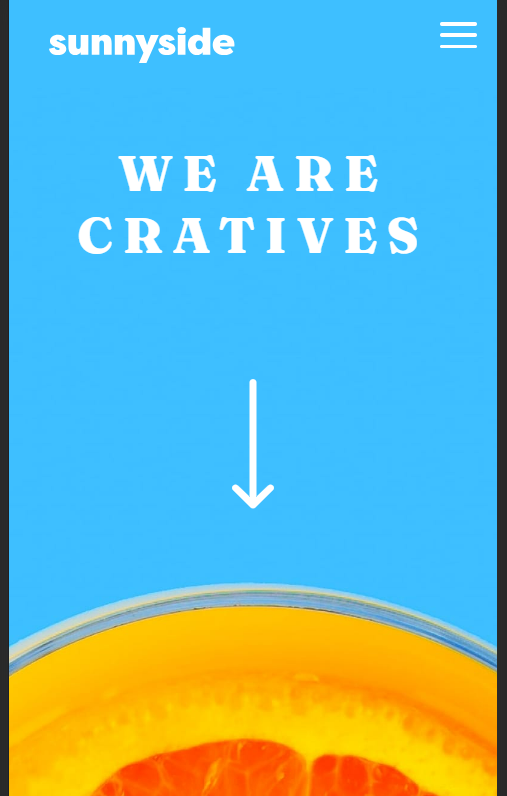

# Frontend Mentor - Sunnyside agency landing page solution

This is a solution to the [Sunnyside agency landing page challenge on Frontend Mentor](https://www.frontendmentor.io/challenges/sunnyside-agency-landing-page-7yVs3B6ef). Frontend Mentor challenges help you improve your coding skills by building realistic projects.

## Table of contents

- [Overview](#overview)
  - [The challenge](#the-challenge)
  - [Screenshot](#screenshot)
  - [Links](#links)
- [My process](#my-process)
  - [Built with](#built-with)
  - [What I learned](#what-i-learned)
  - [Continued development](#continued-development)
  - [Useful resources](#useful-resources)
- [Author](#author)
- [Acknowledgments](#acknowledgments)

## Overview

### The challenge

Users should be able to:

- View the optimal layout for the site depending on their device's screen size
- See hover states for all interactive elements on the page

### Screenshot

### Links

- Solution URL: [Solution URL: ](https://www.frontendmentor.io/solutions/responsive-landing-page-made-with-grid-and-flex-Fj2I1dThI_)
- Live Site URL: [Live URL: ](https://javila26.github.io/sunnyside-landing-page/)

## My process

### Built with

- Semantic HTML5 markup
- CSS custom properties
- Flexbox
- CSS Grid

### What I learned

I used this project to put in practice the concepts of display grid. Thanks to it, it was a much easier task to develop the whole layout of the web page and make it responsive with just needing to touch a fewer lines of code than other projects I made before.

Also another thing worth mention is, this is the first reponsive navbar that I do, will keep practicing more Javascript to create cool stuff like this.

### Continued development

Moving on from here I have interest in continuing developing more complex layouts by mixing up both display grid and flex.

### Useful resources

- [MDN](https://developer.mozilla.org/es/) - It's always useful having an official source of truth. This website helps to be up to date with new changes made for Javascript and CSS tools
- [W3Schools CSS](https://www.w3schools.com/css/) - Having always a bit code to mess with and make sure of understanding a property comes very handy.

## Author

- Website - [Jose Ávila](https://github.com/javila26)
- Frontend Mentor - [@javila26](https://www.frontendmentor.io/profile/javila26)

## Acknowledgments

Thanks to all the people who takes a little of their time to test my projects and give me some feedback. 
